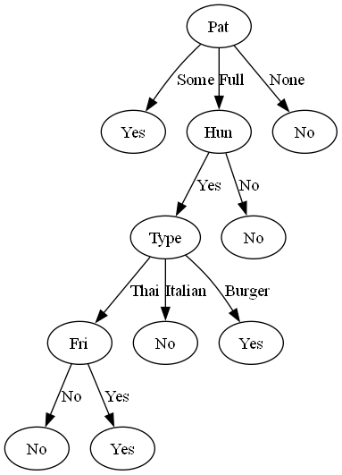

# Decision Tree (ID3) Implementation from Scratch

This folder contains a manual implementation of the **ID3 (Iterative Dichotomiser 3)** algorithm for building Decision Trees using **Entropy** as the impurity measure.

## Project Overview
In this project, we analyze the classic "Restaurant Waiting" dataset to predict customer behavior. Instead of relying solely on libraries, we define the core mathematical components of a Decision Tree.

**Key Concepts Implemented:**
* **Entropy Calculation:** Implementing Shannon Entropy to measure dataset impurity.
* **Information Gain:** Calculating the reduction in entropy to select the optimal splitting feature.
* **Recursive Algorithm:** Building the tree structure by recursively splitting the data.
* **Library Comparison:** Validating the manual implementation against Scikit-Learn's `DecisionTreeClassifier`.

> **Note on Tree Structure:**
> You will notice structural differences between the manually generated tree and the one from Scikit-Learn.
> * **Manual Implementation (ID3):** Creates multi-way splits for categorical features (one branch per unique value).
> * **Scikit-Learn (CART):** Always creates binary trees (two branches per node).
> Therefore, while the classification logic is validated, the visual structure of the trees will differ.

## Files
* `Decision_Tree_Entropy_Manual_Implementation.ipynb`: The main notebook containing the code and visualizations.
* *(Note: The dataset is small and embedded directly within the notebook as a dictionary, so no external CSV file is required.)*

## Visualization
Here is the decision tree generated by the manual implementation:

## How to run
1.  Open the notebook.
2.  Ensure you have `graphviz` installed (`pip install graphviz`) for tree visualization.
3.  Run all cells to see the step-by-step calculation.