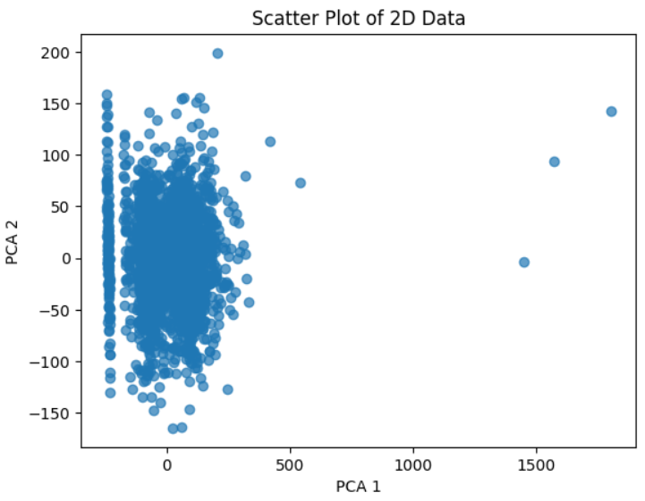
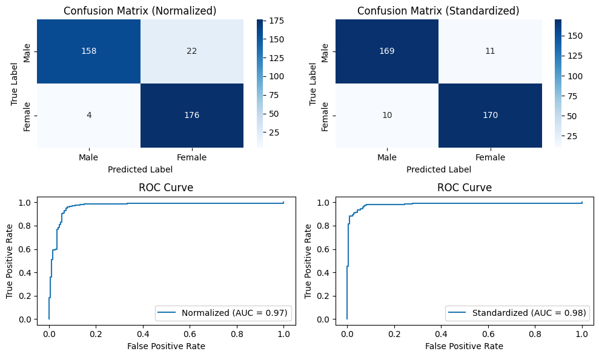
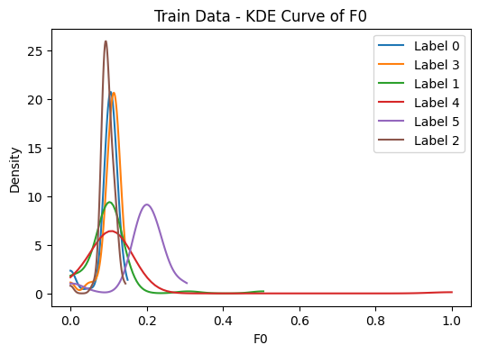

# Audio Signal Processing & Analysis Capstone


This directory hosts a comprehensive end-to-end pipeline for audio signal processing. The project bridges the gap between raw signal analysis and advanced machine learning, demonstrating how to transform unstructured audio data into meaningful insights using both unsupervised and supervised techniques.

## Directory Contents

The analysis is divided into four sequential modules, moving from raw data engineering to complex biometric identification tasks.

| Project Module | Domain | Key Techniques & Frameworks |
| :--- | :--- | :--- |
| **[Preprocessing Pipeline](./notebooks/01_Preprocessing_Pipeline.ipynb)** | Signal Processing (DSP) | **Librosa**, Voice Activity Detection (VAD), Butterworth Low-Pass Filtering, Segmentation, MFCC Extraction. |
| **[Unsupervised Clustering](./notebooks/02_Unsupervised_Clustering.ipynb)** | Pattern Discovery | **PCA** (Dimensionality Reduction), **K-Means Clustering**, Elbow Method, Silhouette Analysis, 2D Visualization. |
| **[Gender Classification](./notebooks/03_Gender_Classification.ipynb)** | Binary Classification | **Deep Learning (MLP)**, PyTorch Custom Module, SVM (RBF Kernel), ROC/AUC Analysis, Dropout Regularization. |
| **[Speaker Identification](./notebooks/04_Speaker_Identification.ipynb)** | Biometrics (Multi-class) | **N-Way Classification**, Random Forest Feature Importance, Kernel Density Estimation (KDE), Cross-Entropy Loss. |

## Technical Focus Areas

The implementations in this directory highlight several critical aspects of applied audio analysis:

### 1. Feature Engineering & DSP
* **Spectral Analysis:** Extracting 20 Mel-Frequency Cepstral Coefficients (MFCCs) to represent the timbre of the voice.
* **Pitch & Noise:** Calculating Fundamental Frequency (F0) and Zero-Crossing Rate (ZCR) to capture vocal characteristics and signal noisiness.

### 2. Deep Learning Architecture (PyTorch)
* **Custom MLP:** We implemented a Multi-Layer Perceptron using `torch.nn.Module` with three fully connected layers.
* **Optimization:** The models utilize `Adam` optimizer and `CrossEntropyLoss`, employing `DataLoader` for efficient batch processing.

### 3. Model Interpretation
* **Confusion Matrices:** Detailed breakdown of True Positives and False Negatives for both gender and speaker tasks.
* **Feature Importance:** Utilizing Random Forest to quantitatively rank which audio features (e.g., F0 vs. MFCCs) contribute most to speaker identity.

## Visualizations & Key Results

### Unsupervised Analysis
We projected the high-dimensional feature vectors into 2D space using PCA. The results show a clear natural separation between male and female voice clusters without using any labels.


*Figure 1: 2D PCA Projection of audio features showing distinct natural groupings.*

### Gender Classification
The PyTorch MLP model achieved high accuracy. The confusion matrix below demonstrates the model's robustness in distinguishing between male and female speakers.



### Speaker Identification (Biometrics)
For the 6-way speaker identification task, we analyzed the unique "Voice Print" of each individual. The KDE plot below proves that **Fundamental Frequency (F0)** is a strong discriminator between speakers.



**Top Discriminative Features:**
Based on Random Forest analysis, the following features carry the most weight for identifying a speaker:

| Rank | Feature | Importance Score | Description |
| :---: | :--- | :---: | :--- |
| 1 | **F0 (Pitch)** | **0.1417** | Fundamental Frequency |
| 2 | **MFCC_18** | **0.1101** | High-frequency timbre |
| 3 | **MFCC_20** | **0.0908** | High-frequency timbre |
| 4 | **MFCC_6** | **0.0836** | Mid-frequency timbre |

## How to run

1.  **Install Dependencies:**
    ```bash
    pip install -r requirements.txt
    ```

2.  **Run the Notebooks:**
    Navigate to the `notebooks/` directory. It is recommended to run the notebooks in order (02 to 04), as they rely on the datasets provided in the `data/` folder.

> **Note on Data Privacy:**
> The raw audio recordings are not included in this repository to protect student privacy. However, the **extracted feature datasets (.csv)** are included in `data/feature_stores/`, allowing full reproducibility of all machine learning and analysis steps (Notebooks 02, 03, and 04).
